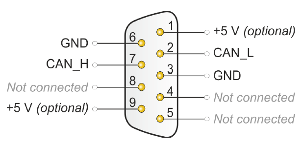
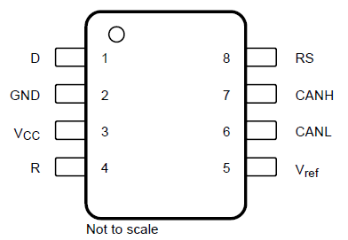
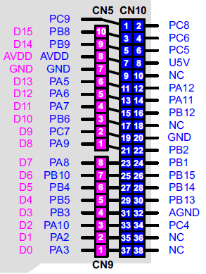

# STM32CANProtocol
This is STM32 CAN Protocol project
### How it works
This Program gets data and sends that to the CAN bus again, also it can be configured in Standard or Extended Frame
## Hardware Requirement
* NUCLEO-F446RE
* PEAK IPEH-002021
* SN65HVD231
* BreadBoard (Optional)
* 120ohm Resistor *2 (Optional)
## Software Requirement
* [Keil uVision 5](https://www.keil.com/download/)
* [PCAN-View](&[default]/../Docs/pcanview.zip)
* [STM32CubeMX](https://www.st.com/en/development-tools/stm32cubemx.html) (Optional)

## How to use
1. Connect devices Like this :
   
PEAK IPEH-002021 | SN65HVD231 | NUCLEO-F446RE
--- | --- | ---
GND | GND | GND
GND | Rs | GND
-- | Vcc | 3V3
CAN_H | CAN_H | --
CAN_L | CAN_L | --
-- | D | PA12 (CAN1 on STM32)
-- | R | PA11 (CAN1 on STM32) 
 |  | 

1. To configure the CAN Speed Use this [WEBSITE](http://www.bittiming.can-wiki.info/)

2. The CAN Speed is `1MBit/s` so The CAN Mode is `High-Speed` \
   The CAN Address for **Receive** is `0x541`    Can be changed from *main.c*\
   The CAN Address for **Transmit** is `0x123`   Can be changed from *main.c*
